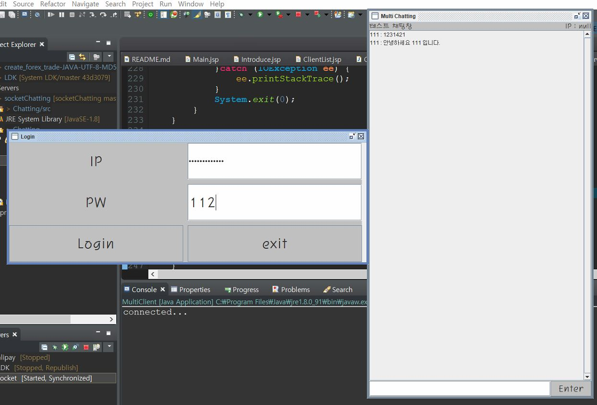
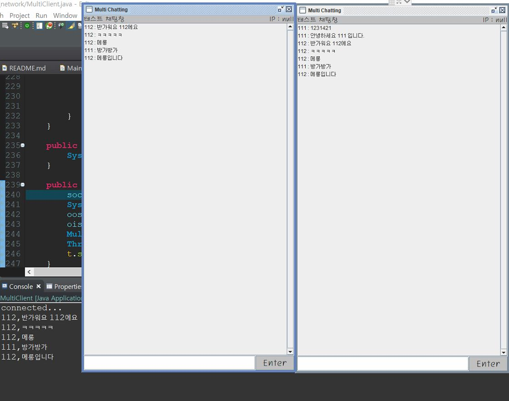

# socketChatting
Java Socket Chatting Project

socket chatting application TestCode
1. 톰캣서버를 기동한다.
2. MultiServer.java를 먼저 실행하여 server ready...문구가 콘솔에 출력될때까지 기다린다.
3. MultiClient.java를 실행한다. IP와 채팅방에서 사용할 pw입력하여 접속한다.
4. 다중의 Client를 실행하여 서로통신해본다.
 

실행예제

